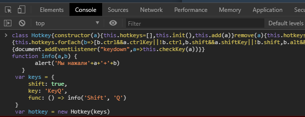

# Hotkey

***Описание***:
Удобное назначение сочетаний клавиш и вызов твоей функции при обнаружении заданного тобой сочетания.
Описание расчитано всех, поэтому в тексте будут делатся ссылки на всем известные обучающие материалы, чтобы сэкономить время новичкам.

***

### ***Перейдём к примерам***:
Перед созданием экземпляра нужно подумать, что будет происходить при возникновении нашего сочетания.

Создадим простейшую **[функцию](https://learn.javascript.ru/function-basics)**, которая будет информировать нас о нём.
```js 
   function info(a,b) {
       alert('Мы нажали'+a+'+'+b) 
   }
```
Ещё для примеров понадобится функция без аргументов.
```js 
   function infonoargs() {
       alert('Мы нажали наше сочетание') 
   }
```
Теперь можно приступать к созданию нашего сочетания. Оно реализовано в виде **[обьекта](https://learn.javascript.ru/object)**, в котором присутствует от 3-х до 5-и свойств.

Первые 4 свойства - выборочные. Т.е. они все необязательны, но должны присутствовать хотя бы 2 из них. Работать функция будет и с одним свойством, но это уже будет не сочетание, а простое нажатие на клавишу - не совсем то, что нам нужно.

А вот и сами свойства:
```js
  shift: true
  crtl: true
  alt: true
  key: Тут мы указываем, какую из основных клавиш мы хотим нажать. Если мы хотим нажать клавишу от А до Z, к примеру G - пишем 'KeyG', от 0 до 9, к примеру 5 - пишем 'Digit5', от F1 до F12, к примеру F3 - пишем 'F3'. Если же вам не хватит такого набора, можете сами посмотреть, как начинается свойство code определённой группы клавиш.
  func: () => функция()
  ```

  Создадим сочетание shift+Q, при котором будет выполнятся наша свежая функция info.  
```js 
   var keys = {
       shift: true, // Указываем, что в сочетание будет входить клавиша shift
       key: 'KeyQ', // В сочетании есть клавиша Q 
       func: () => info('Shift', 'Q') // Чтобы функция не вызывалась при нажатии любой клавиши, а только при нашем сочетании, сделаем ей небольшую обёртку в виде стрелочной функции:  () => наша_функция()
   }
```
  Рассмотрим вариант, когда наша функция не имеет аргументов.
  ```js
   func: infonoargs // Так как функция не имеет аргументов, она не вызовется сразу. Её можно написать без обёртки
  ```
  ### ***Начнём***
  Скорее всего, уже не терпится начать, создадим экземпляр сочетаний.
  ```js
  var hotkey = new Hotkey(keys) // Мы передали в аргументы обьект сочетания, но можно и массив обьектов new Hotkey([key1, key2])
  ```
  Сочетание готово и запущено. Не помешало бы узнать о свойствах и методах экземпляра:
  ```js
  hotkey.hotkeys // Список существующих сочетаний
  hotkey.add(так же, как и при создании экземпляра. Обьект или массив обьектов) // Добавление сочетания(-ий)
  hotkey.remove(index) // удаление сочетания по индексу
  ```
  Так же нам никто не мешает:
  ```js
  delete hotkey.hotkeys[0].shift // удалять, 
  hotkey.hotkeys[0].alt = true   // добавлять
  hotkey.hotkeys[0].key = 'KeyR' // и изменять параметры наших сочетаний
  ```

***

### ***Активация***:

- Для теста можно открыть консоль на любой странице, вставить код **[Hotkey.min.js](lib/Hotkey.min.js)** + код из примеров.

  > 

- Для постоянного использования лучше всего воспользоваться расширением для браузера, которое может добавлять собственные скрипты для указанных сайтов.
  Одним из таких расширений является **[Resource Override](https://chrome.google.com/webstore/detail/resource-override/pkoacgokdfckfpndoffpifphamojphii?hl=ru)**

  Создаем правило для адреса `https://vk.com` или же `*`, чтобы ваши сочетания работали на всех сайтах и выбираем `Inject File`:
  > 

  Нажимаем `Edit File`:

  В открывшийся редактор вставляем содержимое файла **[Hotkey.min.js](lib/Hotkey.min.js)**
  Теперь можно создавать свои собственные сочетания, исходя из примеров.


